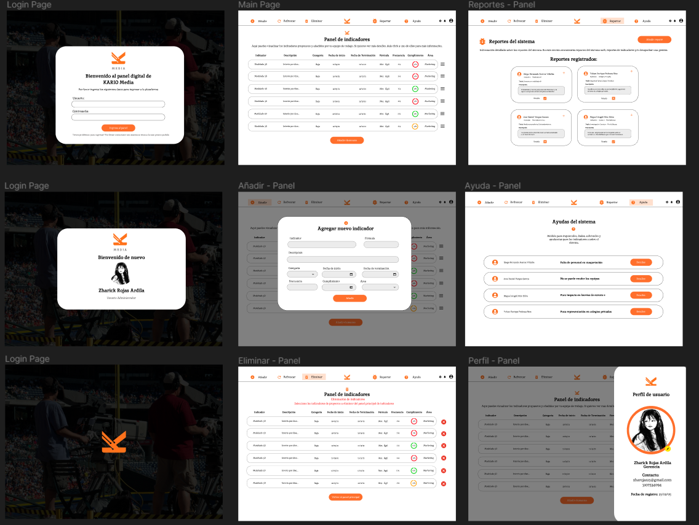
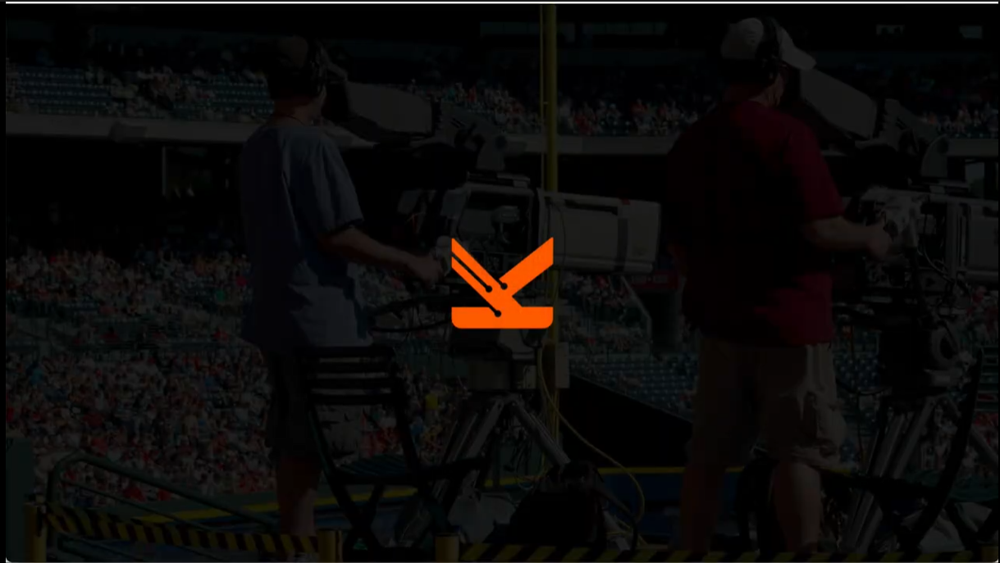
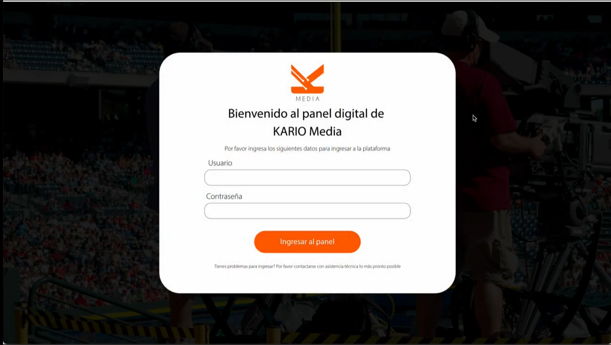
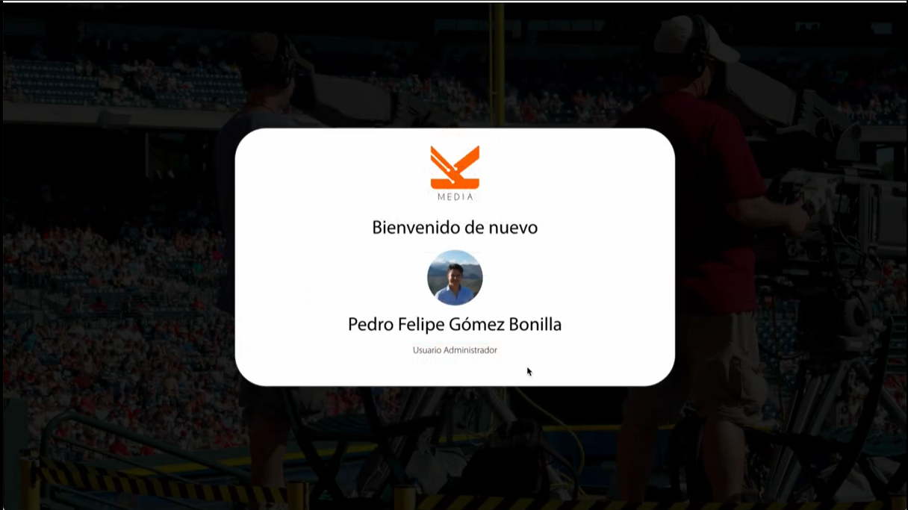
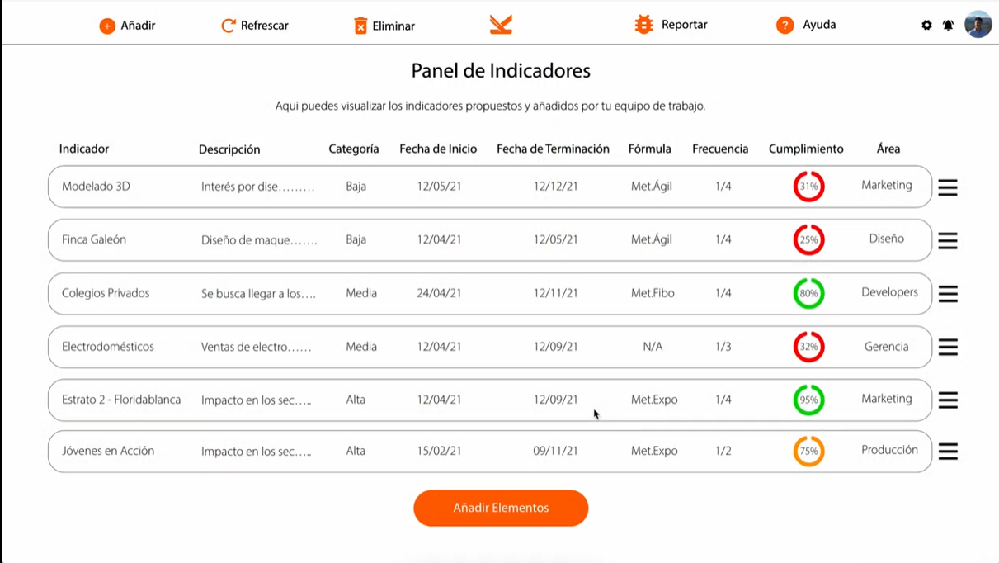

# Kario Media - Panel de Gestión de Proyectos

## Descripción

**Kario Media** es una empresa dedicada a la gestión de licitaciones públicas y privadas en diversos nichos de negocio. Este proyecto consiste en el desarrollo de un aplicativo web administrativo, cuyo objetivo es mostrar y gestionar los indicadores clave de los proyectos de la empresa, siguiendo fielmente el flujo y diseño propuesto por el equipo de UI/UX.

El sistema permite a los usuarios administrativos acceder a un panel centralizado donde pueden añadir, eliminar, reportar y consultar indicadores, así como acceder a módulos de ayuda y gestionar su perfil (login/logout).

## Wireframes

A continuación se presenta el enlace al wireframe propuesto por el equipo de UI/UX, el cual sirvió como base para el desarrollo y diseño de este aplicativo web.  
**Enlace al wireframe:** [Ver wireframe aquí](Pega_aquí_el_enlace_al_wireframe)

> El diseño, estructura y flujo de navegación de la aplicación replican fielmente la propuesta visual y de experiencia de usuario entregada por el equipo de diseño.

## Mockups y Wireframes

A continuación se muestran algunos mockups y wireframes utilizados como referencia para el desarrollo del proyecto:

### Wireframe General



### Mockup 1



### Mockup 2



### Mockup 3



### Mockup 4



## Características principales

- **Panel de Indicadores**: Visualización clara y responsiva de todos los indicadores del proyecto.
- **Módulo Añadir**: Permite agregar nuevos indicadores mediante un modal intuitivo.
- **Módulo Eliminar**: Gestión y eliminación de indicadores de forma sencilla y segura.
- **Módulo Reportar**: Reporte de incidencias o problemas relacionados con los indicadores.
- **Módulo Ayuda**: Sección de ayuda interactiva para guiar al usuario en el uso del sistema.
- **Módulo Perfil**: Gestión de sesión de usuario (login/logout) y visualización de información personal.
- **Diseño Responsive**: Adaptado para dispositivos móviles, tablets y escritorio, utilizando media queries y buenas prácticas de UI/UX.
- **Fiel al Wireframe**: El diseño y flujo replican al 100% la propuesta entregada por el equipo de diseño.

## Tecnologías utilizadas

- **HTML5** (estructura)
- **CSS3** (estilos y responsive design)
- **Sin frameworks ni librerías externas**: Todo el código es nativo, cumpliendo con los requerimientos del proyecto.

## Estructura del proyecto

```
Kario-Media/
│
├── assets/                # Imágenes, íconos y recursos gráficos
├── css/                   # Hojas de estilo CSS separadas por módulo
│   ├── add-modal-styles.css
│   ├── ayuda-styles.css
│   ├── dashboard-styles.css
│   ├── eliminar-styles.css
│   ├── nav-styles.css
│   ├── reportar-modal-styles.css
│   ├── reportar-styles.css
│   └── usuario-modal-styles.css
├── pages/                 # Páginas HTML de cada módulo
│   ├── ayuda.html
│   ├── dashboard.html
│   ├── eliminar.html
│   └── reportar.html
├── index.html             # Página principal o de acceso
└── README.md              # Este archivo
```

## Instalación y uso

1. **Clona el repositorio**  
   ```bash
   git clone https://github.com/tu-usuario/PROYECTO-FILTRO_APELLIDO1NOMBRE1_APELLIDO2NOMBRE2.git
   ```

2. **Abre el proyecto**  
   Puedes abrir el archivo `index.html` o cualquiera de las páginas dentro de la carpeta `pages/` directamente en tu navegador.

3. **Navegación**  
   Utiliza la barra de navegación para acceder a los diferentes módulos: Dashboard, Añadir, Eliminar, Reportar, Ayuda y Perfil.

## Requerimientos técnicos

- Código 100% nativo HTML y CSS.
- No se utilizan frameworks, librerías externas ni preprocesadores.
- Diseño completamente responsive, adaptado a cualquier dispositivo.
- Separación de estilos por módulo para facilitar el mantenimiento.
- Replicación exacta del wireframe y flujo de UI/UX entregado.

## Créditos

- **Desarrollador FrontEnd:** Pamela Michell Galvis Álvarez
- **UI/UX:** Equipo de diseño de Kario Media

## Reconocimientos

- Proyecto calificado con **100/100** por cumplir todos los requerimientos y replicar fielmente el diseño propuesto.
- Excelente dominio del código y buenas prácticas de desarrollo.
